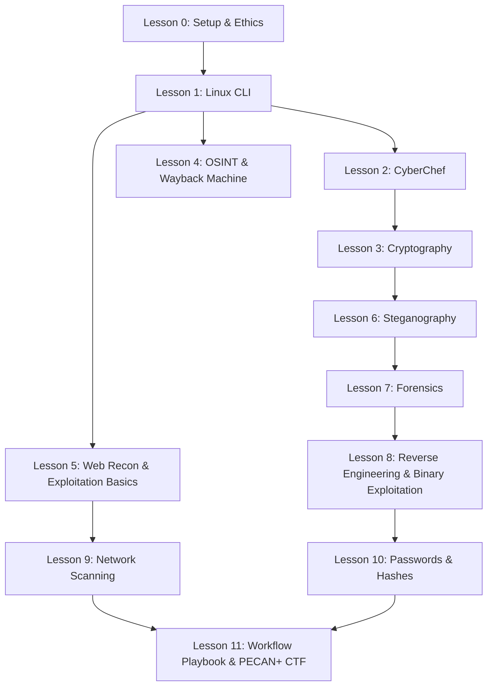

# Course Plan — Kali Linux & CTF Skills

A scaffolded series of lessons that takes a high school student from "what is a
terminal?" to **competing in a Capture The Flag (CTF) competition** using Kali
Linux. The course is built around the six challenge categories used by the
**[PECAN+ practice CTF](https://practice.pecanplus.org/)** (organised by Edith
Cowan University for Australian high schools).

> [!IMPORTANT]
> Every skill in this course is for **legal, authorised** practice only — your
> own container and the sanctioned practice targets listed in each lesson. Read
> [labs/00-ethics-and-safety.md](labs/00-ethics-and-safety.md) first.

---

## Course goals

By the end of the course a student can:

1. Confidently use the Kali Linux command line.
2. Encode, decode and decrypt data with **CyberChef** and terminal tools.
3. Perform OSINT, including recovering old website versions with the **Wayback Machine**.
4. Solve beginner challenges in all six CTF categories below.
5. Enter and compete in the **PECAN+ CTF** (flag format: `pecan{...}`).

## The CTF target

All lessons map to live challenges on the practice CTF:

| CTF Category        | Practice challenges (difficulty)                                |
| ------------------- | --------------------------------------------------------------- |
| Cryptography        | Encoded (B), Take note (B), Climbing (I)                        |
| Forensics           | 3D flag (B), ABC company (I), HackersAttack (I), DoS'ed out (A) |
| OSINT               | Kidnapped part 1 (B), Kidnapped part 2 (B), Missing friend (I)  |
| Reverse Engineering | Love letter (B)                                                 |
| Steganography       | Head in the clouds (B), Matchy matchy (B), The guy (I)          |
| Web exploits        | Bite my shiny metal (B), Lamb Source 1 (B), Mr Robot (I)        |

_(B = Beginner, I = Intermediate, A = Advanced)_

Try them here ➜ **https://practice.pecanplus.org/?page=challenges**

---

## Course map



---

## Lessons

### Lesson 0 — Setup & Ethics

- **Goal:** Open the codespace, understand legal/ethical rules.
- **Material:** [labs/00-ethics-and-safety.md](labs/00-ethics-and-safety.md)
- **Key commands:** `whoami`, `cat /etc/os-release`
- **CTF link:** Rules of engagement; the `pecan{...}` flag format.

### Lesson 1 — Linux Command Line

- **Goal:** Navigate the filesystem; read, search and pipe files.
- **Material:** [labs/01-linux-command-line.md](labs/01-linux-command-line.md)
- **Key commands:** `ls`, `cd`, `cat`, `grep`, `man`, `find`, `strings`, `file`
- **CTF link:** Almost every challenge starts at the terminal.

### Lesson 2 — Encoding, Decoding & CyberChef ⭐

- **Goal:** Recognise and convert Base64, hex, binary, URL, ROT13; use the
  **CyberChef** "recipe" approach, then reproduce it on the command line.
- **Material:** [labs/02-cyberchef.md](labs/02-cyberchef.md)
- **Tool:** **https://gchq.github.io/CyberChef/** ("the Cyber Swiss Army Knife")
- **Workflow:**
  1. Paste data into CyberChef, drag operations (e.g. _From Base64_, _Magic_)
     to build a recipe.
  2. Use the **Magic** operation to auto-detect encodings.
  3. Reproduce the result in the terminal to prove you understand it.
- **Key commands:**
  ```bash
  echo -n "cGVjYW57aGVsbG99" | base64 -d        # From Base64
  echo -n "pecan{hello}" | base64               # To Base64
  echo -n "70 65 63 61 6e" | xxd -r -p           # From hex
  echo "Urypb" | tr 'A-Za-z' 'N-ZA-Mn-za-m'      # ROT13
  ```
- **CTF link:** Cryptography → _Encoded_, _Take note_.

### Lesson 3 — Cryptography Basics

- **Goal:** Caesar/ROT, XOR, and simple `openssl` ciphers and hashing.
- **Material:** [labs/03-cryptography.md](labs/03-cryptography.md)
- **Key commands:**
  ```bash
  echo -n "secret" | openssl dgst -sha256        # hashing
  openssl enc -aes-256-cbc -pbkdf2 -in msg.txt -out msg.enc
  openssl enc -d -aes-256-cbc -pbkdf2 -in msg.enc # decrypt
  echo -n "pecan" | base32                        # other encodings
  ```
- **CTF link:** Cryptography → _Climbing_ (and CyberChef from Lesson 2).

### Lesson 4 — OSINT & the Wayback Machine ⭐

- **Goal:** Find public information about a person/site; recover **old versions
  of a website** using the **Internet Archive Wayback Machine**.
- **Material:** [labs/04-osint-wayback.md](labs/04-osint-wayback.md)
- **Tools:** **https://web.archive.org/** , `whois`, `dig`, `curl`, image EXIF.
- **Workflow:**
  1. Browse `https://web.archive.org/web/*/<site>` to list saved snapshots.
  2. Open an older snapshot to read content the site owner has since removed
     (deleted pages, old emails, leaked flags).
  3. Pull a specific snapshot from the terminal:
     ```bash
     # List archived snapshots as JSON (newest first)
     curl -s "http://archive.org/wayback/available?url=example.com"
     # Fetch a specific historical capture (timestamp = YYYYMMDDhhmmss)
     curl -s "https://web.archive.org/web/20200101000000/http://example.com/"
     ```
- **CTF link:** OSINT → _Kidnapped part 1 & 2_, _Missing friend_.

### Lesson 5 — Web Reconnaissance & Exploits

- **Goal:** Inspect a website's source, headers, `robots.txt` and hidden
  directories, then test parameters safely for common web exploit paths.
- **Material:** [labs/05-web-recon.md](labs/05-web-recon.md)
- **Key commands:**
  ```bash
  curl -s http://testphp.vulnweb.com/robots.txt    # disallowed paths leak info
  curl -s http://testphp.vulnweb.com | grep -i "flag\|hidden\|TODO"
  whatweb http://testphp.vulnweb.com
  gobuster dir -u http://testphp.vulnweb.com -w /usr/share/wordlists/dirb/common.txt
  sqlmap --version
  ```
- **CTF link:** Web exploits → _Bite my shiny metal_ (robots.txt), _Lamb Source 1_
  (page source), _Mr Robot_ (hidden directory).

### Lesson 6 — Steganography

- **Goal:** Find data hidden inside images, audio and other files.
- **Material:** [labs/06-steganography.md](labs/06-steganography.md)
- **Key commands:**
  ```bash
  exiftool image.jpg                 # read metadata (flags hide here)
  strings image.png | grep pecan     # plain text inside a file
  steghide extract -sf secret.jpg    # extract a hidden payload
  binwalk image.png                  # spot embedded files
  ```
- **CTF link:** Steganography → _Head in the clouds_, _Matchy matchy_, _The guy_ (EXIF).

### Lesson 7 — Forensics

- **Goal:** Identify file types, carve embedded files, and read packet captures.
- **Material:** [labs/07-forensics.md](labs/07-forensics.md)
- **Key commands:**
  ```bash
  file mystery                        # what is this really?
  binwalk -e firmware.bin             # extract embedded files
  foremost -i disk.img -o output/     # carve files by signature
  tshark -r capture.pcap -Y http      # read HTTP from a packet capture
  ```
- **CTF link:** Forensics → _3D flag_, _ABC company_ (pcap), _HackersAttack_, _DoS'ed out_.

### Lesson 8 — Reverse Engineering & Binary Exploitation Basics

- **Goal:** Inspect a compiled program to recover its secret, then apply core
  pwn workflow concepts (debugging, offsets, endianness).
- **Material:** [labs/08-reverse-engineering.md](labs/08-reverse-engineering.md)
- **Key commands:**
  ```bash
  file program                        # architecture & type
  strings program | grep pecan        # easy wins first
  objdump -d program | less           # disassemble
  radare2 -A program                  # interactive analysis (q to quit)
  gdb -q /bin/ls -ex "info files" -ex "quit" | head -n 8
  ```
- **CTF link:** Reverse Engineering → _Love letter_.

### Lesson 9 — Network Scanning

- **Goal:** Discover hosts, ports and services.
- **Material:** [labs/09-network-scanning-nmap.md](labs/09-network-scanning-nmap.md)
- **Key commands:** `nmap -sn`, `nmap -sV scanme.nmap.org`, `dig`, `whois`
- **CTF link:** Recon used across Forensics & Web categories.

### Lesson 10 — Passwords & Hashes

- **Goal:** Understand hashing and crack weak passwords ethically.
- **Material:** [labs/10-passwords-and-hashes.md](labs/10-passwords-and-hashes.md)
- **Key commands:** `hashid`, `john`, `md5sum`, `sha256sum`
- **CTF link:** Supports Cryptography & Forensics challenges.

### Lesson 11 — CTF Workflow Playbook & Competition 🏁

- **Goal:** Apply a repeatable competition workflow, then solve live challenges
  and capture flags.
- **Material:** [labs/11-ctf-competition.md](labs/11-ctf-competition.md)
- **Workflow:**
  1. Triage challenge list and bank quick beginner solves first.
  2. Use a consistent solve loop: identify category, run fast checks, switch tools once.
  3. Time-box blockers and hand off clean notes to teammates.
  4. Open **https://practice.pecanplus.org/?page=challenges** and submit flags in `pecan{...}` format.
- **Stretch:** Register for the real competition via
  [pecanplus.org/register.html](https://pecanplus.org/register.html).

---

## Validating the commands

Every command taught above is checked by an automated **pytest** suite so we
know they work in this codespace:

```bash
python3 -m pytest -v            # run all command checks
python3 -m pytest -m "not network" -v   # skip internet-dependent checks
```

See [tests/test_commands.py](tests/test_commands.py).

## Cheat sheet

Keep the [Kali Linux & CTF Cheat Sheet](CHEATSHEET.md) open while you work — it
lists every command in the course in **command → expected output** form, grouped
by CTF category, plus a set of flag-hunting one-liners.

## Suggested timetable

| Week | Lessons              |
| ---- | -------------------- |
| 1    | 0, 1                 |
| 2    | 2, 3                 |
| 3    | 4, 5                 |
| 4    | 6, 7                 |
| 5    | 8, 9, 10             |
| 6    | 11 — CTF competition |

## Further practice

- [PECAN+ practice CTF](https://practice.pecanplus.org/)
- [picoCTF](https://picoctf.org/) · [TryHackMe](https://tryhackme.com/) ·
  [OverTheWire: Bandit](https://overthewire.org/wargames/bandit/)
- [CyberChef](https://gchq.github.io/CyberChef/) ·
  [Wayback Machine](https://web.archive.org/)
