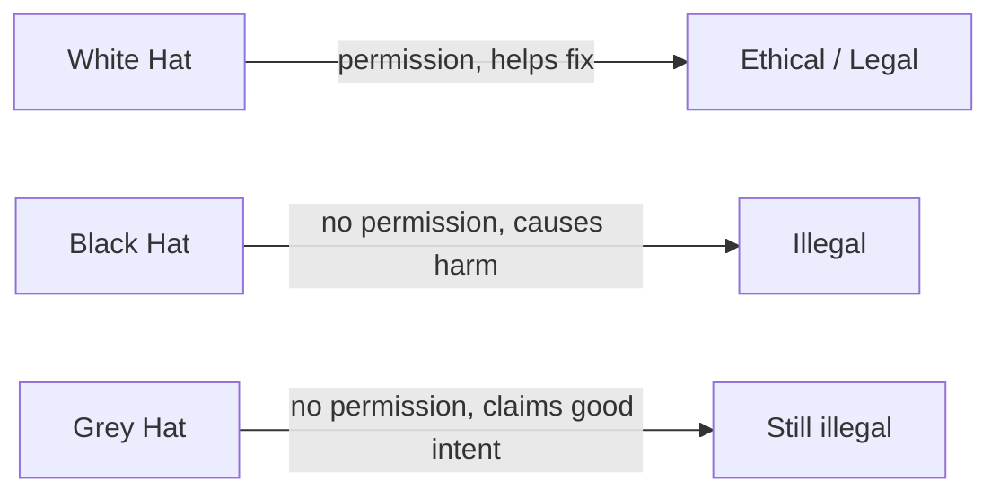

# Lesson 00 — Ethics & Safety

Before touching any tool, start with context: what this course is and why it
matters.

If you want a quick video intro before starting:

- [What Is a CTF? (YouTube)](https://www.youtube.com/watch?v=mb0taQQBlQY)

## What is cyber security?

Cyber security is protecting computers, websites and data from being stolen,
broken, or misused. In real life, this means things like:

- finding weak passwords before attackers do,
- fixing unsafe website code,
- investigating suspicious files or network traffic.

These are practical digital safety skills used by defenders in schools,
businesses and government.

## What is a CTF?

CTF means **Capture The Flag**. It is a legal training game where you solve
puzzles to find a hidden code (a flag), usually in a format like `pecan{...}`.

- You are given a clue, file, or website challenge.
- You investigate using tools.
- You submit the flag and score points.

Think of it like a digital escape room for problem-solving.

## Why are you learning this?

You are learning to think like a defender:

- spot weaknesses safely,
- understand how attacks work,
- and protect systems in the real world.

These skills can lead to competitions, certifications, and careers in IT or
cyber security.

Now the most important rule: cyber skills are powerful. Using them the right
way makes you a **defender**. Using them the wrong way is a **crime**.

## The one golden rule

> Only test systems you **own** or have **explicit written permission** to test.

That's it. If you don't have permission, don't do it — even "just to see if it
works".

## What is allowed in this course

- Anything **inside this container** (it's your own disposable machine).
- The official **public practice targets** below, which the owners have set up
  for learning:
  - `scanme.nmap.org` — Nmap's legal scanning playground.
  - `testphp.vulnweb.com` — Acunetix's deliberately vulnerable demo site.
  - `http://demo.testfire.net` — a fake bank for practice.

## What is NOT allowed

- Scanning, attacking, or "testing" your school network, your friends' devices,
  websites, game servers, or anyone else's systems.
- Trying to access accounts, data, or Wi-Fi that isn't yours.

## Why it matters

| Action                       | Outcome                             |
| ---------------------------- | ----------------------------------- |
| Practising on legal targets  | You build real, employable skills   |
| Attacking without permission | Suspension, police, criminal record |

## Key vocabulary

- **Vulnerability** — a weakness in a system.
- **Exploit** — code or steps that take advantage of a vulnerability.
- **Penetration test (pentest)** — a _permitted_ simulated attack to find and
  fix weaknesses.

## ✅ Challenge

1. **Do:** Decide whether the request "scan my phone" is allowed in this course.
2. **Verify:** List two targets you _are_ allowed to scan here.
3. **Explain:** Describe the difference between a vulnerability and an exploit.
4. **Practice:** Write the one golden rule in your own words.

➡️ Next: [Lesson 01 — Linux Command Line](01-linux-command-line.md)
