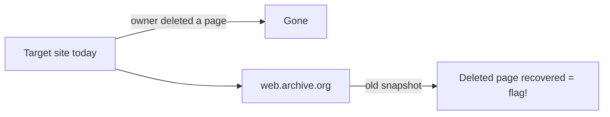

# Lesson 04 — OSINT & the Wayback Machine

**OSINT** = Open Source INTelligence: finding information that is already public.
CTF "OSINT" challenges give you a photo, a name or a website and ask you to dig
up a hidden detail. One of the most powerful OSINT tools is the **Wayback
Machine**, which stores old versions of websites — including pages and secrets
the owner later deleted.

> [!IMPORTANT]
> OSINT means **public** information only. Never try to log into accounts or
> access private data. See [Lesson 00](00-ethics-and-safety.md).

## Learning goals

- Gather public info about a domain with `whois` and `dig`.
- Read **EXIF** metadata from a photo (where/when it was taken).
- Use the **Wayback Machine** to view and fetch old versions of a website.

## Part A — Domain intel

```bash
# Who registered the domain, and when?
whois example.com | grep -iE "registrar|creation|expir"
```

```bash
# What IP address does the name point to?
dig +short scanme.nmap.org
```

Expected output:

```
45.33.32.156
```

## Part B — Photo metadata (EXIF)

Phone photos often embed GPS coordinates and a timestamp. Read them with:

```bash
exiftool photo.jpg | grep -iE "GPS|Date|Model"
```

Paste any `GPS Position` straight into Google Maps to find where it was taken.

## Part C — The Wayback Machine ⭐

Website: **https://web.archive.org/**

### In the browser

1. Go to `https://web.archive.org/web/*/SITE` (replace `SITE`), e.g.
   `https://web.archive.org/web/*/pecanplus.org`.
2. You'll see a calendar of every saved **snapshot**. Click an old date.
3. Read the site **as it was** — deleted pages, old staff emails, removed
   "temporary" flags often survive here.

### From the terminal

```bash
# Ask the Wayback API for the closest saved snapshot
curl -s "http://archive.org/wayback/available?url=example.com"
```

Expected output (timestamp will vary):

```
{"url": "example.com", "archived_snapshots": {"closest": {"status": "200", "available": true, "url": "http://web.archive.org/web/20260620000127/https://example.com/", "timestamp": "20260620000127"}}}
```

```bash
# Fetch a specific historical capture (timestamp = YYYYMMDDhhmmss)
curl -s "https://web.archive.org/web/20200101000000/http://example.com/" | head
```

This prints the HTML of the site **as it looked in 2020**.



## ✅ Challenge

1. **Do:** Find the **creation date** of `example.com` with `whois`.
2. **Verify:** Use the Wayback API and record the latest snapshot timestamp for `pecanplus.org`.
3. **Explain:** Write one OSINT clue type you can recover from an old snapshot.
4. **Practice:** Complete **OSINT → _Kidnapped part 1 & 2_** and **_Missing friend_** at
   [practice.pecanplus.org](https://practice.pecanplus.org/?page=challenges).

➡️ Next: [Lesson 05 — Web Reconnaissance](05-web-recon.md)
