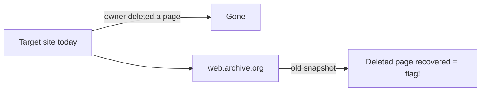

# Lesson 04 — OSINT & the Wayback Machine

**OSINT** = Open Source INTelligence: finding information that is already public.
CTF "OSINT" challenges give you a photo, a name or a website and ask you to dig
up a hidden detail. One of the most powerful OSINT tools is the **Wayback
Machine**, which stores old versions of websites — including pages and secrets
the owner later deleted.

> [!IMPORTANT]
> OSINT means **public** information only. Never try to log into accounts or
> access private data. See [Lesson 00](00-ethics-and-safety.md).

## Learning goals

- Gather public info about a domain with `whois` and `dig`.
- Read **EXIF** metadata from a photo (where/when it was taken).
- Use the **Wayback Machine** to view and fetch old versions of a website.
- Search like a researcher using **search operators**, **Wikipedia** and **reverse image search**.
- Read foreign-language signs and pages with **Google Translate**.
- Pin down a location from a photo using **Google Lens**, **Google Earth**,
  **Google Street View** and **OpenStreetMap**.

## Part A — Domain intel

```bash
# Who registered the domain, and when?
whois example.com | grep -iE "registrar|creation|expir"
```

```bash
# What IP address does the name point to?
dig +short scanme.nmap.org
```

Expected output:

```
45.33.32.156
```

## Part B — Photo metadata (EXIF)

Phone photos often embed GPS coordinates and a timestamp. Read them with:

```bash
exiftool photo.jpg | grep -iE "GPS|Date|Model"
```

Paste any `GPS Position` straight into Google Maps to find where it was taken.

## Part C — The Wayback Machine ⭐

Website: **https://web.archive.org/**

### In the browser

1. Go to `https://web.archive.org/web/*/SITE` (replace `SITE`), e.g.
   `https://web.archive.org/web/*/pecanplus.org`.
2. You'll see a calendar of every saved **snapshot**. Click an old date.
3. Read the site **as it was** — deleted pages, old staff emails, removed
   "temporary" flags often survive here.

### From the terminal

```bash
# Ask the Wayback API for the closest saved snapshot
curl -s "https://archive.org/wayback/available?url=example.com"
```

Expected output (timestamp will vary):

```
{"url": "example.com", "archived_snapshots": {"closest": {"status": "200", "available": true, "url": "http://web.archive.org/web/20260620000127/https://example.com/", "timestamp": "20260620000127"}}}
```

```bash
# Fetch a specific historical capture (timestamp = YYYYMMDDhhmmss)
curl -s "https://web.archive.org/web/20200101000000/http://example.com/" | head
```

This prints the HTML of the site **as it looked in 2020**.


```mermaid
flowchart LR
    A[Target site today] -->|owner deleted a page| X[Gone]
    A --> W[web.archive.org]
    W -->|old snapshot| F[Deleted page recovered = flag!]
```

## Part D — Search like a researcher 🔎

Most OSINT flags are not cracked with a hacking tool. They are cracked with a
**good search**. The difference between a beginner and a strong OSINT player is
usually how well they phrase the question.

### Search operators (Google, Bing, DuckDuckGo)

| Operator              | What it does                          | Example                         |
| --------------------- | ------------------------------------- | ------------------------------- |
| `"exact phrase"`      | Only pages with those exact words     | `"Tempe High School robotics"`  |
| `site:`               | Restrict to one website               | `site:pecanplus.org challenges` |
| `filetype:`           | Only one file type                    | `filetype:pdf annual report`    |
| `intitle:` / `inurl:` | Word must be in the page title or URL | `inurl:admin`                   |
| `-word`               | Exclude a word                        | `jaguar -car`                   |
| `OR`                  | Either term                           | `"J. Smith" OR "John Smith"`    |
| `before:` / `after:`  | Limit by date                         | `after:2020 flood report`       |

> [!TIP]
> If a search returns too much, add a rare word. If it returns nothing, remove
> the rarest word. Iterate — don't retype the same query hoping for a new result.

### Wikipedia as a research launchpad

Wikipedia is rarely the answer, but it is often the fastest route **to** the
answer:

- **Infobox** (right-hand panel): dates, coordinates, official website, founders.
- **References section**: the primary sources you should actually cite.
- **External links**: official sites, archives, databases.
- **View history**: like a Wayback Machine for the article — see what was
  changed or removed, and when.
- **Other language versions**: the local-language article often has detail the
  English one omits.

### Other free research sources

| Source                                            | Use it for                                                   |
| ------------------------------------------------- | ------------------------------------------------------------ |
| Wikidata                                          | Structured facts, IDs, coordinates                           |
| [Google Translate](https://translate.google.com/) | Reading signs, menus and foreign-language pages (see Part E) |
| [Google Earth](https://earth.google.com/web/)     | 3D terrain, historical imagery, measuring distances          |
| [Google Street View](https://www.google.com/maps) | Standing on the street to match a photo                      |
| [OpenStreetMap](https://www.openstreetmap.org)    | Named paths, buildings and amenities other maps leave off    |
| Company/charity registers                         | Official names, addresses, registration dates                |
| News archives                                     | Dates and eyewitness detail for an event                     |
| Flight/ship trackers                              | Aircraft and vessel movements from public feeds              |

## Part E — Reverse image search & geolocation 🗺️

When a challenge hands you a photo with no metadata, the **picture itself** is
the evidence.

### Step 1 — Reverse image search

Run the same image through **more than one** engine; they index different pages:

- **Google Lens / Google Images** — best for landmarks and products.
- **TinEye** — best for finding the _original_ and oldest copy of an image.
- **Yandex Images** — often strongest at faces, buildings and scenery.
- **Bing Visual Search** — good second opinion.

Crop to the distinctive part (a sign, a logo, a tower) and search that alone —
engines match a clean subject far better than a busy scene.

### Step 2 — Read the clues in the photo

Work through this checklist before you guess:

- **Language and alphabet** on signs, and the **phone number format**.
- **Business names** — search the name plus a likely city.
- **Vehicles**: which side of the road, number-plate colour and shape.
- **Infrastructure**: power poles, bollards, road markings, kerb style.
- **Nature**: tree and plant types hint at climate and hemisphere.
- **Sun and shadows**: direction and length hint at time of day and latitude.
- **Architecture**: roof style, building materials, window shapes.

#### Can't read the sign? Use Google Translate

[Google Translate](https://translate.google.com/) turns a foreign sign into a
searchable place name — and the **language itself** narrows the country before
you translate a word.

- **Image tab:** upload the photo (or a crop of just the sign) and it reads and
  translates the text for you — no typing an alphabet you don't know.
- **Detect language:** paste any text and let it identify the language first.
  Cyrillic, Thai, Georgian or Amharic script alone shrinks the search to a few
  countries.
- **Translate the answer back:** once you have a candidate business name,
  translate it _into_ the local language and search **that** — local-language
  results are far richer than the English ones.
- **Website tab:** paste a foreign URL to read a whole page (e.g. a council or
  news site) in English.

> [!TIP]
> Machine translation of a sign is a **lead**, not proof. Confirm the translated
> business name exists at the location on a map before you commit to it.

### Step 3 — Confirm on a map

1. Search the candidate place name in **Google Maps**, then use **Street View**
   to stand where the photographer stood and compare the skyline. Drag the
   yellow figure onto a road, then look for the same shopfronts, signs, poles
   and kerbs that are in the photo.
2. Open [**Google Earth**](https://earth.google.com/web/) for the things Street
   View can't show you:
   - **Historical imagery** — step back through years of satellite photos to
     match a building that has since changed or been demolished.
   - **3D buildings and terrain** — tilt the view to compare a skyline or the
     shape of hills behind the subject.
   - **Measure tool** — check that a distance in the photo (street width, path
     length) matches the candidate site.
3. Cross-check on **OpenStreetMap** (`https://www.openstreetmap.org`) — it shows
   named paths, buildings and amenities that other maps leave off.
4. Paste any `GPS Position` from Part B directly into any of these maps to jump
   straight to the spot.

```bash
# Coordinates from exiftool in a copy-paste friendly form
exiftool -c "%.6f" -GPSPosition photo.jpg
```

Expected output:

```
GPS Position                    : -33.867487, 151.206990
```

> [!TIP]
> Never accept a single clue as proof. Confirm a location with **at least two**
> independent details — e.g. a matching shopfront _and_ a matching street layout.

## ✅ Challenge

1. **Do:** Find the **creation date** of `example.com` with `whois`, then use a
   `site:` search to find one page on that domain.
2. **Verify:** Use the Wayback API and record the latest snapshot timestamp for `pecanplus.org`.
3. **Do:** Find a photo of a sign in a language you can't read, run it through
   the **Image** tab of [Google Translate](https://translate.google.com/), then
   locate the place in **Google Street View** and **Google Earth**.
4. **Explain:** Take any photo of a public place, reverse image search it, and
   write the two clues that let you confirm the location on a map.
5. **Practice:** Complete **OSINT → _Kidnapped part 1 & 2_** and **_Missing friend_** at
   [practice.pecanplus.org](https://practice.pecanplus.org/?page=challenges).

➡️ Next: [Lesson 05 — Web Reconnaissance](05-web-recon.md)
