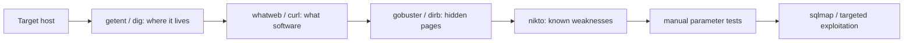

# Lesson 05 — Web Reconnaissance & Exploitation Basics

Most hacking targets are **websites**. Recon ("reconnaissance") means gathering
information about a web server _before_ deciding anything else. Good defenders
do this to find their own weak spots first.

> [!IMPORTANT]
> This lab targets the **DVWA (Damn Vulnerable Web Application)** that is
> **built into this repo**. It runs in its own container and is reachable at
> **`http://dvwa`** from the Kali terminal, and at **`http://localhost:4280`**
> in a browser tab. It is offline and safe to attack. Do **not** point these
> tools at any other site without written permission.

> [!TIP]
> Some exercises need you to log in first. Open **`http://localhost:4280`**, log
> in with **`admin` / `password`**, and on the **DVWA Security** page set the
> level to **Low** so the examples behave predictably. On a brand-new container,
> click **Setup / Reset DB** on the _Create / Reset Database_ page once.
> Full setup and troubleshooting: [DVWA Help Guide](../DVWA_HELP.md).

## Learning goals

- Identify web technologies and hidden content.
- Use `curl` to send GET and POST requests and inspect responses.
- Test parameters safely for common web vulnerabilities.
- Understand the basic workflow for SQL injection and input tampering.

## 1. Who is behind a domain?

`whois` and DNS lookups work on **public** domains (DVWA is internal, so it has
no public WHOIS record). Practise the technique on a public domain — it needs
internet access:

```bash
whois example.com | grep -iE "registrar|creation|expir"
nslookup example.com    # find the IP address
dig example.com         # more detailed DNS lookup
```

For our local target, resolve its container IP instead:

```bash
getent hosts dvwa       # shows the IP DVWA is running on
```

## 2. What is the server running?

```bash
# whatweb fingerprints the technologies a site uses
whatweb http://dvwa
```

```bash
# curl shows the raw HTTP response headers (-I = headers only)
curl -I http://dvwa/login.php
```

Look for headers like `Server:` and `X-Powered-By:` — they leak software names
(DVWA reports Apache and PHP).

### 2a. `curl` for GET data, POST data, and endpoint probing

Basic GET request:

```bash
curl -s "http://dvwa/login.php" | head -n 10
```

Probe endpoint status codes quickly:

```bash
for p in / /login.php /robots.txt /setup.php /instructions.php /doesnotexist; do
  code=$(curl -s -o /dev/null -w "%{http_code}" "http://dvwa${p}")
  printf "%-18s %s\n" "$p" "$code"
done
```

A `200` means the page exists, `301/302` is a redirect, and `404` means not
found. (DVWA redirects `/` to `login.php` until you are signed in.)

POST form data (safe echo service example — needs internet):

```bash
curl -s -X POST "https://httpbin.org/post" \
  -d "username=student&role=learner" | head -n 20
```

POST JSON data:

```bash
curl -s -X POST "https://httpbin.org/post" \
  -H "Content-Type: application/json" \
  -d '{"id":1,"note":"training"}' | head -n 20
```

Use `-i` to include headers in output, and `-v` for verbose request/response debug.

## 3. Find hidden pages and folders

Web servers often have pages that aren't linked anywhere. `gobuster` guesses
common names from a wordlist.

```bash
gobuster dir -u http://dvwa \
  -w /usr/share/wordlists/dirb/common.txt
```

`dirb` does the same job with a simpler command:

```bash
dirb http://dvwa
```

## 4. Scan for known issues

`nikto` checks a web server against a database of common problems.

```bash
nikto -h http://dvwa
```

## 5. Move from recon to exploitation

After recon, the next CTF skill is testing user-controlled input. Always start
with simple manual checks before automation.

DVWA's vulnerable pages require you to be **logged in**, so do the one-time setup
from the tip at the top of this lab first: log in at `http://localhost:4280`
(`admin` / `password`), reset the database if needed, and set **Security → Low**.

### 5a. Parameter tampering (manual)

Open the **SQL Injection** page in DVWA
(`http://localhost:4280/vulnerabilities/sqli/`). In the **User ID** box, enter
different values and watch how the page reacts:

- Enter `1` → you see one user (First name / Surname).
- Enter `2` → you see a different user.

If the content changes based on input, that parameter is interesting. Parameter
tampering means changing URL/query values to test whether the server validates
input safely.

### 5b. SQL injection probing (built-in DVWA target only)

Still on the **User ID** box, try an input that breaks out of the query:

```text
1' OR '1'='1
```

Instead of one user, DVWA now lists **every** user in the table — proof that your
input changed the database query. A single quote (`'`) by itself often triggers a
visible SQL error, which is another tell-tale sign of an injectable field.

### 5c. Automation with sqlmap

`sqlmap` can do the same thing automatically, but it needs your logged-in
**session cookie** so it can reach the vulnerable page. In the browser, open
DevTools → **Application/Storage → Cookies** and copy the `PHPSESSID` value.

Confirm sqlmap is available:

```bash
sqlmap --version
```

Run a low-impact check against the built-in DVWA target (replace
`<PHPSESSID>` with your cookie value):

```bash
sqlmap -u "http://dvwa/vulnerabilities/sqli/?id=1&Submit=Submit" \
  --cookie="PHPSESSID=<PHPSESSID>; security=low" \
  --batch --level=1 --risk=1
```

Add `--dbs` to list databases or `--dump` to extract a table once injection is
confirmed. Use `--batch` for non-interactive mode. In real competitions, start
narrow and only increase depth when needed.

### 5d. Common web exploit patterns to recognise

- **SQL injection**: input changes the database query.
- **XSS**: input is reflected back into the page as script.
- **Command injection**: input reaches shell/system commands.
- **Path traversal**: input reads files outside intended folders (`../`).
- **Auth/session flaws**: weak tokens, predictable IDs, or missing checks.

## Recon workflow



## ✅ Challenge

1. What web server software and language does `http://dvwa` report in its headers?
2. Use `gobuster` against `http://dvwa` and list two folders or files it discovered.
3. On the DVWA SQL Injection page (Security = Low), enter `1`, then `2`, then
   `1' OR '1'='1` and describe what changed each time.
4. Run `sqlmap --version` and explain what problem type sqlmap is designed to test.
5. Send one POST form request and one POST JSON request to `https://httpbin.org/post`, then identify where your submitted values appear in the response.
6. Use a small `curl` loop to probe at least 5 endpoints on `http://dvwa` and report which returned `200`, `301/302`, or `404`.

➡️ Next: [Lesson 06 — Steganography](06-steganography.md)
