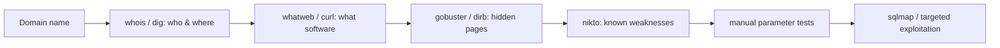

# Lesson 05 — Web Reconnaissance & Exploitation Basics

Most hacking targets are **websites**. Recon ("reconnaissance") means gathering
information about a web server _before_ deciding anything else. Good defenders
do this to find their own weak spots first.

> [!IMPORTANT]
> Practise only on the legal demo site **`testphp.vulnweb.com`** (built to be
> hacked for learning) or your own container. Nothing else.

## Learning goals

- Identify web technologies and hidden content.
- Test parameters safely for common web vulnerabilities.
- Understand the basic workflow for SQL injection and input tampering.

## 1. Who is behind a domain?

```bash
whois vulnweb.com | grep -iE "registrar|creation|expir"
nslookup testphp.vulnweb.com    # find the IP address
dig testphp.vulnweb.com         # more detailed DNS lookup
```

## 2. What is the server running?

```bash
# whatweb fingerprints the technologies a site uses
whatweb http://testphp.vulnweb.com
```

```bash
# curl shows the raw HTTP response headers (-I = headers only)
curl -I http://testphp.vulnweb.com
```

Look for headers like `Server:` and `X-Powered-By:` — they leak software names.

## 3. Find hidden pages and folders

Web servers often have pages that aren't linked anywhere. `gobuster` guesses
common names from a wordlist.

```bash
gobuster dir -u http://testphp.vulnweb.com \
  -w /usr/share/wordlists/dirb/common.txt
```

`dirb` does the same job with a simpler command:

```bash
dirb http://testphp.vulnweb.com
```

## 4. Scan for known issues

`nikto` checks a web server against a database of common problems.

```bash
nikto -h http://testphp.vulnweb.com
```

## 5. Move from recon to exploitation

After recon, the next CTF skill is testing user-controlled input. Always start
with simple manual checks before automation.

### 5a. Parameter tampering (manual)

Look at how a page reacts when you change parameters:

```bash
curl -s "http://testphp.vulnweb.com/listproducts.php?cat=1" | head -n 5
curl -s "http://testphp.vulnweb.com/listproducts.php?cat=2" | head -n 5
```

If content changes based on input, that parameter is interesting.

Parameter tampering means changing URL/query values to test whether the server
validates input safely.

### 5b. SQL injection probing (safe training target only)

Try an input that often reveals weak query handling:

```bash
curl -s "http://testphp.vulnweb.com/listproducts.php?cat=1%27" | head -n 20
```

In CTFs, SQL-related error messages can confirm injectable input.

### 5c. Automation with sqlmap

Confirm sqlmap is available:

```bash
sqlmap --version
```

Run a low-impact check against the legal practice target:

```bash
sqlmap -u "http://testphp.vulnweb.com/listproducts.php?cat=1" --batch --level=1 --risk=1
```

Use `--batch` for non-interactive mode. In real competitions, start narrow and
only increase depth when needed.

### 5d. Common web exploit patterns to recognise

- **SQL injection**: input changes the database query.
- **XSS**: input is reflected back into the page as script.
- **Command injection**: input reaches shell/system commands.
- **Path traversal**: input reads files outside intended folders (`../`).
- **Auth/session flaws**: weak tokens, predictable IDs, or missing checks.

## Recon workflow



## ✅ Challenge

1. What web server software does `testphp.vulnweb.com` report in its headers?
2. Use `gobuster` and list two folders or files it discovered.
3. Test `cat` with `1`, `2`, and `1%27` and describe what changed.
4. Run `sqlmap --version` and explain what problem type sqlmap is designed to test.

➡️ Next: [Lesson 06 — Steganography](06-steganography.md)
