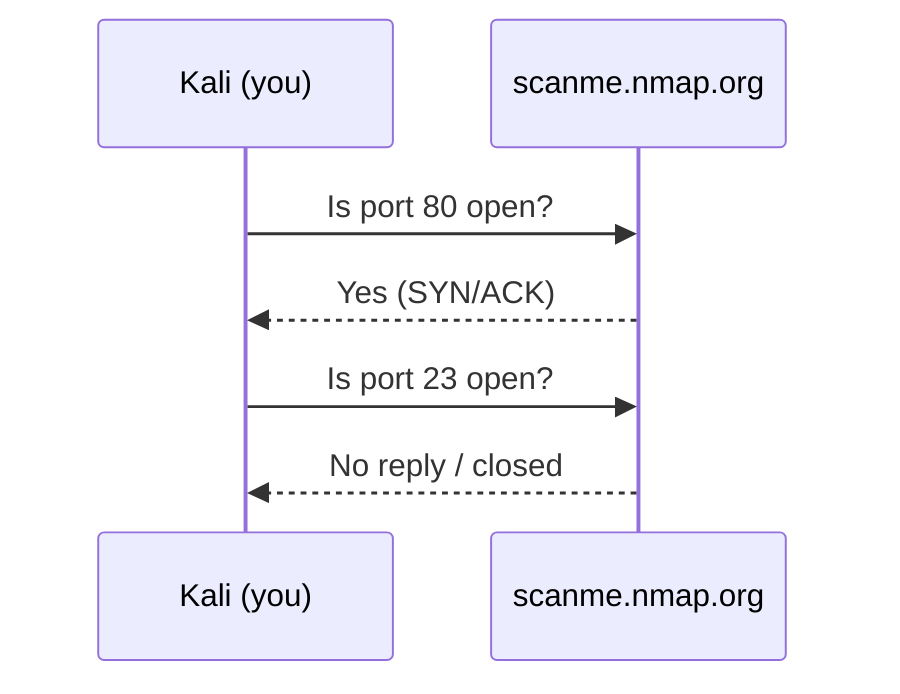

# Lesson 09 — Network Scanning with Nmap

**Nmap** ("Network Mapper") finds devices on a network and the **ports** they
have open. Open ports are doors into a computer — knowing which are open is the
first step in both attacking _and_ defending.

> [!IMPORTANT]
> Over the internet we only scan **`scanme.nmap.org`**, which Nmap provides for
> legal practice. Do not scan anything else without permission.
> (See [Lesson 00](00-ethics-and-safety.md).)

> [!TIP]
> No internet? This repo ships a **built-in DVWA** target you can scan offline.
> From the Kali terminal it answers to the hostname **`dvwa`**, e.g.
> `nmap dvwa`. It only runs a web server, so expect to see port **80/tcp** open.
> Need DVWA setup/troubleshooting details? See [DVWA Help Guide](../DVWA_HELP.md).

## Ports in 30 seconds

A computer has 65,535 ports. Common ones:

| Port | Service                 |
| ---- | ----------------------- |
| 22   | SSH (remote login)      |
| 80   | HTTP (websites)         |
| 443  | HTTPS (secure websites) |
| 25   | SMTP (email)            |

## Your first scan

```bash
# Is the target alive? (a "ping" scan)
nmap -sn scanme.nmap.org
```

```bash
# Scan the most common ports
nmap scanme.nmap.org
```

Read the output: each line shows a port, whether it's `open`/`closed`, and the
likely service.

## Going deeper

```bash
# -sV  = detect the version of software behind each open port
nmap -sV scanme.nmap.org
```

```bash
# -O   = guess the operating system (needs sudo)
sudo nmap -O scanme.nmap.org
```

```bash
# Scan a specific list of ports only
nmap -p 22,80,443 scanme.nmap.org
```

## Save your results

```bash
nmap -sV scanme.nmap.org -oN my_scan.txt
cat my_scan.txt
```

## Offline practice on the built-in DVWA

If you can't reach the internet, scan the local DVWA container instead:

```bash
# Find its open ports (expect 80/tcp = HTTP)
nmap dvwa

# Identify the web server software behind the open port
nmap -sV -p 80 dvwa
```

This pairs nicely with [Lesson 05 — Web Recon](05-web-recon.md), which attacks
that same web server.

## How it works



## ✅ Challenge

1. How many ports did Nmap report as `open` on `scanme.nmap.org`?
2. What service and version is running on port 22?
3. What does the `-sV` flag add compared to a plain scan?
4. Save a version scan to a file and open it in the VS Code editor.

➡️ Next: [Lesson 10 — Password & Hash Basics](10-passwords-and-hashes.md)
