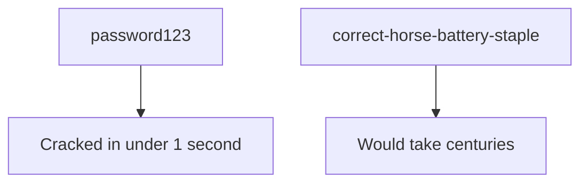

# Lesson 10 — Password & Hash Basics

Passwords are almost never stored as plain text. They are turned into a
**hash** — a scrambled fingerprint that can't easily be reversed. In this lab
you'll see why **weak passwords are dangerous** and how attackers crack them, so
you can choose strong ones yourself.

> [!IMPORTANT]
> We only crack hashes **you create yourself** in this container. Cracking other
> people's passwords without permission is illegal.

## 1. What is a hash?

A hash function always turns the same input into the same output, but you can't
work backwards to the original.

```bash
echo -n "password123" | md5sum
echo -n "password123" | sha256sum
echo -n "password124" | sha256sum   # one character changes everything
```

## 2. Identify a hash type

```bash
hashid 5f4dcc3b5aa765d61d8327deb882cf99
```

## 3. Crack a weak password with John the Ripper

First, make a fake user and hash (this stays inside your container):

```bash
# Create a hash of a weak password
echo -n "letmein" | md5sum | awk '{print $1}' > hash.txt
cat hash.txt
```

Now let **John** try to crack it using a wordlist of common passwords:

```bash
john --format=raw-md5 --wordlist=/usr/share/wordlists/john.lst hash.txt
john --show --format=raw-md5 hash.txt    # reveal what it found
```

Because `letmein` is a common password, John finds it almost instantly. Try
again with a long random password and watch it fail.

## 3b. Hydra (concept demo)

`hydra` tries many passwords against a _login_. Run its help to see how it
works — **do not** point it at real services:

```bash
hydra -h | head -n 20
```

## 4. Why this matters



| Habit                                       | Strength  |
| ------------------------------------------- | --------- |
| Short, common word                          | ❌ Weak   |
| Long passphrase of random words             | ✅ Strong |
| Same password everywhere                    | ❌ Weak   |
| Unique password per site + password manager | ✅ Strong |

## ✅ Challenge

1. **Do:** Hash `qwerty`, crack it with John, and record how long it took.
2. **Verify:** Hash a 20-character random password, try to crack it, and record what happened.
3. **Explain:** In your own words, describe why a long passphrase is safer than a short complex one.
4. **Practice:** Create your own long passphrase, hash it, and test whether John cracks it quickly.

➡️ Next: [Lesson 11 — Compete in the PECAN+ CTF](11-ctf-competition.md)
